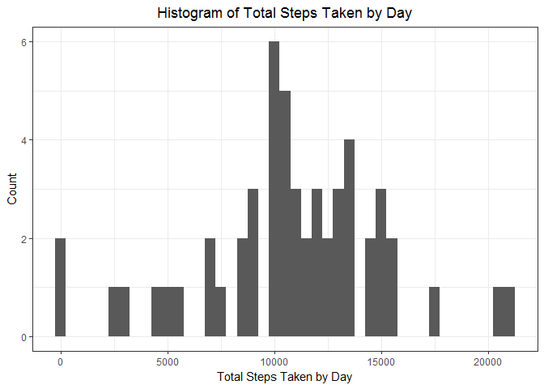
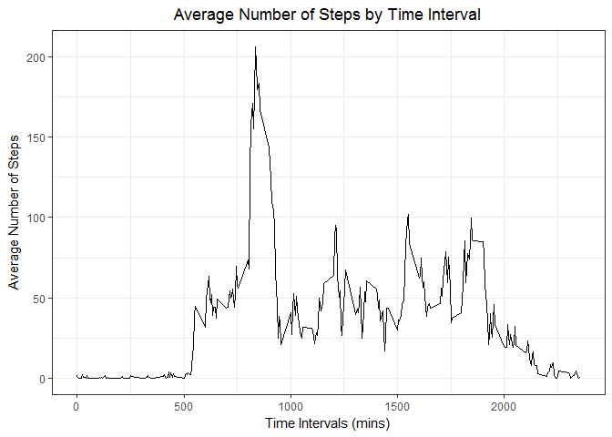
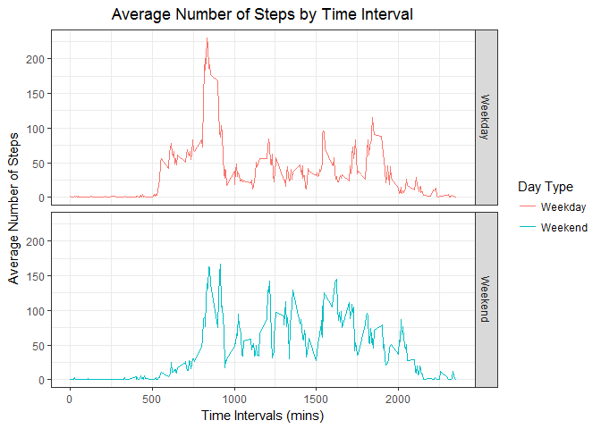

# Reproducible Research: Peer Assessment 1
Date: 2017-08-04  
By: Jacob M. Lundeen

## Loading and preprocessing the data

```r
##The needed libraries are loaded and then the file is downloaded, unzipped and read in as a data table.
library(data.table)
library(ggplot2)
temp <- tempfile()
download.file("https://d396qusza40orc.cloudfront.net/repdata%2Fdata%2Factivity.zip",temp)
data <- as.data.table(read.csv(unz(temp, "activity.csv")))
unlink(temp)
```

## What is mean total number of steps taken per day?

```r
##Calculate the sum of the steps on a daily basis
step.sum <- na.omit(data[, list(stepSum = sum(steps)), by = "date"])

##Use ggplot2 to create histogram
g <- ggplot(step.sum, aes(stepSum))
g + geom_histogram(binwidth = 500, show.legend = FALSE) + labs(x = "Total Steps Taken by Day", y = "Count", title = "Histogram of Total Steps Taken by Day") + theme_bw() + 
     theme(plot.title = element_text(hjust = 0.5))
```

<!-- -->

```r
##Calculate mean and median values of daily step totals
step.mean <- mean(step.sum$stepSum)
step.median <- median(step.sum$stepSum)
```

* Mean: 10766.19
* Median: 10765

## What is the average daily activity pattern?

```r
##Calculate the average number of steps per five minute interval
step.interval <- aggregate(steps ~ interval, data, mean)

##Use ggplot2 to create line graph
q <- ggplot(step.interval, aes(x = interval, y = steps))
q + geom_line() + labs(x = "Time Intervals (mins)", y = "Average Number of Steps", 
                       title = "Average Number of Steps by Time Interval") + 
     theme_bw() + theme(plot.title = element_text(hjust = 0.5))
```

<!-- -->


```r
##Find the index number of the interval with the largest amount of steps
step.max <- which.max(step.interval$steps)
```

The 5-minute interval, on average across all days, that contains the maximum number of steps is 835. The number of steps is 206.17.

## Imputing missing values

```r
##Find total number of missing values from the original data set
step.miss <- sum(is.na(data))
```
The original data set is missing 2304 values.


```r
##Create new data set that will be used to impute missing values
impute.Data <- data

##For loop that will run through new dataset and will set the missing values to the mean value of their respective intervals
for (i in 1:nrow(data))
{
     if(is.na(data$steps[i]))
     {
          impute.Data$steps[i] <- step.interval$steps[which(step.interval$interval == data$interval[i])]
     }
}

##Sum up the number of steps by date
impute.sum <- impute.Data[, list(imputeSum = sum(steps)), by = "date"]

##Create plot with ggplot2
p <- ggplot(impute.sum, aes(imputeSum))
g + geom_histogram(binwidth = 500, show.legend = FALSE) + labs(x = "Total Steps Taken by Day", y = "Count", title = "Histogram of Total Steps Taken by Day") + theme_bw() + 
     theme(plot.title = element_text(hjust = 0.5))
```

<!-- -->

```r
##Calculate mean and median of the new imputed totals
impute.mean <- mean(impute.sum$imputeSum)
impute.median <- median(impute.sum$imputeSum)
```
* Mean: 10766.19
* Median: 10766.19

We can see that the mean value has not changed, but the median value has changed to be equal to the mean value. The impact is, as expected, that the count total increased.

## Are there differences in activity patterns between weekdays and weekends?


```r
##Coerce the date column into a date class
impute.Data$date <- as.Date(impute.Data$date)

##Run through the imputed dataset and, using the weekdays() function, create a new variable that distinguishes between "Weekday" and "Weekend" for every observation.
for (i in 1:nrow(impute.Data))
{
     if(!(weekdays(impute.Data$date[i]) == "Saturday" || weekdays(impute.Data$date[i]) == "Sunday"))
     {
          impute.Data$day.type[i] <- "Weekday"
     }
     else
     {
          impute.Data$day.type[i] <- "Weekend"
     }

}

##Calculate the average number of steps based on interval and day type.
impute.interval <- aggregate(steps ~ interval + day.type, impute.Data, mean)

##Use ggplot2 to create the graphs
z <- ggplot(impute.interval, aes(x = interval, y = steps))
z + geom_line(stat = "identity", aes(color = day.type)) + labs(x = "Time Intervals (mins)", 
                                                               y = "Average Number of Steps", 
                       title = "Average Number of Steps by Time Interval") + 
     theme_bw() + theme(plot.title = element_text(hjust = 0.5)) + facet_grid(day.type ~.) +
     scale_color_discrete(name = "Day Type")
```

<!-- -->

We can see from the graphs above that activity tends to start later in the day on the weekend and is more consistent throughout the day. There is no morning spike and then large drop off, as we see in the weekday graph.
